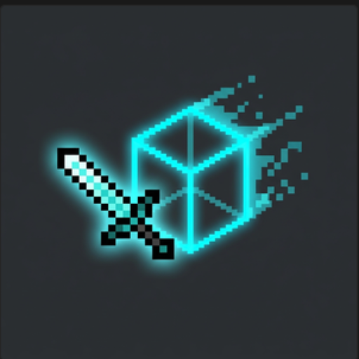

# PingSync (Fabric 1.21.1)

<p align="center">
  
</p>

> **Client-Side Ping Synchronization & Dynamic Backtrack Mod for Minecraft Fabric 1.21.1**

---

## 📍 Table of Contents / Быстрый переход

- 🇬🇧 **[English Documentation](#english)**
  - [Overview](#overview)
  - [Features](#features)
  - [Commands & Controls](#commands--controls)
  - [Download & Installation](#download--installation)
  - [Building from Source](#building-from-source)
- 🇷🇺 **[Русская Документация](#русский)**
  - [Обзор](#обзор)
  - [Возможности](#возможности)
  - [Команды и Настройки](#команды-и-настройки)
  - [Скачивание и Установка](#скачивание-и-установка)
  - [Сборка проекта](#сборка-проекта)

---

<a name="english"></a>
## 🇬🇧 English Documentation

### Overview
**PingSync** is a client-side visualization and hit registration synchronization mod for Minecraft Fabric 1.21.1. It accurately renders server-side lag compensation position history based on your network latency ($yourPing$), giving clear visual feedback on hitboxes and 3D player models.

### Features
- 🎯 **3D Backtrack Hitboxes**: Renders color-coded 3D hitboxes (`LAST TICK` or `ALL TICKS`).
- 👻 **3D Player Ghost Models (Chams)**: Visualizes historical player positions as 3D ghost models using original player skin textures (`ORIGINAL`) or customizable color presets.
- ⏳ **Chrono Fade**: Smooth dynamic opacity gradient fading older ticks in `ALL TICKS` mode.
- 🏷️ **Ghost Nametag Suppression**: Automatically suppresses duplicate floating nametags over 3D ghost models.
- 🚀 **High Performance (1000+ FPS)**: Includes Distance Culling (default: 16 blocks) and Ghost Stride Sampling (max 5 models per entity).

### Commands & Controls

In-game GUI is accessible via **ModMenu** or chat command `/pingsync` (alias `/backtrack`):

| Command | Description |
| :--- | :--- |
| `/pingsync status` | Displays current mod status and latency sync info |
| `/pingsync toggle` | Toggles backtrack rendering ON / OFF |
| `/pingsync color <hitbox\|ghost> <preset>` | Sets color preset (`original`, `cyan`, `red`, `green`, `purple`, `gold`, `rainbow`) |
| `/pingsync distance <blocks>` | Configures max render distance (4..64 blocks) |
| `/pingsync ghostalpha <0..100>` | Sets 3D ghost model opacity percentage |
| `/pingsync chronofade` | Toggles dynamic fade opacity gradient |
| `/pingsync render <hitbox\|ghost> <last_tick\|all_ticks>` | Switches render mode between `LAST TICK` and `ALL TICKS` |

### Download & Installation
1. Download the latest compiled **[PingSync-1.0.0.jar](https://github.com/joke161/PingSync/releases/download/v1.0.0/PingSync-1.0.0.jar)** from [GitHub Releases](https://github.com/joke161/PingSync/releases/tag/v1.0.0).
2. Place `PingSync-1.0.0.jar` into your Minecraft `.minecraft/mods` directory.
3. Ensure **Fabric Loader** and **Fabric API** for 1.21.1 are installed.

### Building from Source
```bash
git clone https://github.com/joke161/PingSync.git
cd PingSync
./gradlew build
```
Output compiled JAR will be located at `build/libs/PingSync-1.0.0.jar`.

---

<a name="русский"></a>
## 🇷🇺 Русская Документация

### Обзор
**PingSync** — это клиентский мод на визуализацию компенсации сетевого пинга для Minecraft Fabric 1.21.1. Мод с высокой точностью рассчитывает позицию игроков на основе вашего сетевого пинга ($yourPing$) и отображает хитбоксы и 3D-модели призраков.

### Возможности
- 🎯 **3D Хитбоксы**: Отрисовка цветных 3D-хитбоксов (`LAST TICK` или `ALL TICKS`).
- 👻 **3D-Призрак Игрока (Chams)**: Отображение 3D-модели призрака игрока с оригинальным скином (`ORIGINAL`) или пресетами цвета.
- ⏳ **Chrono Fade**: Плавный угасающий градиент прозрачности для старых тиков в режиме `ALL TICKS`.
- 🏷️ **Отключение ников призрака**: Автоматическое скрытие дублирующихся ников над 3D-моделями.
- 🚀 **Оптимизация (1000+ FPS)**: Отсечение объектов дальше 16 блоков и сэмплирование моделей до 5 штук на сущность.

### Команды и Настройки

Управление через **ModMenu** и команду `/pingsync` (или `/backtrack`):

| Команда | Описание |
| :--- | :--- |
| `/pingsync status` | Статус мода и текущие параметры |
| `/pingsync toggle` | Включить / Выключить рендеринг |
| `/pingsync color <hitbox\|ghost> <preset>` | Изменить цвет хитбоксов или призрака |
| `/pingsync distance <blocks>` | Дистанция рендеринга (4..64 блоков) |
| `/pingsync ghostalpha <0..100>` | Прозрачность 3D-модели призрака |
| `/pingsync chronofade` | Переключить плавный градиент угасания |
| `/pingsync render <hitbox\|ghost> <last_tick\|all_ticks>` | Переключить режим рендера (`LAST TICK` / `ALL TICKS`) |

### Скачивание и Установка
1. Скачайте собранный файл **[PingSync-1.0.0.jar](https://github.com/joke161/PingSync/releases/download/v1.0.0/PingSync-1.0.0.jar)** со страницы [GitHub Releases](https://github.com/joke161/PingSync/releases/tag/v1.0.0).
2. Поместите `PingSync-1.0.0.jar` в папку `.minecraft/mods`.

### Сборка проекта
```bash
git clone https://github.com/joke161/PingSync.git
cd PingSync
./gradlew build
```

---

## 📜 License
Author: **joke**  
License: **MIT**
